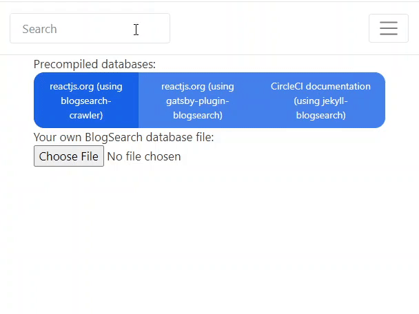

= BlogSearch

// Asciidoc references
// Documentation: https://asciidoctor.org/docs/user-manual/
// Quick reference: https://asciidoctor.org/docs/asciidoc-syntax-quick-reference/
// Asciidoc vs Markdown: https://asciidoctor.org/docs/user-manual/#comparison-by-example
// GitHub Flavored Asciidoc (GFA): https://gist.github.com/dcode/0cfbf2699a1fe9b46ff04c41721dda74

:project-version: 0.0.3
:rootdir: https://github.com/kbumsik/blogsearch

ifdef::env-github[]
// Emoji
:tip-caption: :bulb:
:note-caption: :information_source:
:important-caption: :heavy_exclamation_mark:
:caution-caption: :fire:
:warning-caption: :warning:
// URL
:imagesdir: https://raw.githubusercontent.com/kbumsik/blogsearch/master
endif::[]

image::https://github.com/kbumsik/blogsearch/workflows/Build%20and%20Test%20CI/badge.svg[link="https://github.com/kbumsik/blogsearch/actions?query=workflow%3A%22Build+and+Test+CI%22"]

https://kbumsik.io/blogsearch[Try it!]

[.lead]
BlogSearch is a blogging tool that enables a search engine without any external
services.

This is like https://docsearch.algolia.com/[DocSearch] but for blogs.

More technically, BlogSearch is a pure client-side, full-text search engine for static websites, powered by SQLite compiled to WebAssembly.

.Features:
* Purely client-side search
* No server to maintain. No service cost.
* Easy. It's built for blogs and static websites in mind.
* Supports popular blog frameworks:
** https://jekyllrb.com/[Jekyll]
** https://www.gatsbyjs.org/[Gatsby]
** https://gohugo.io/[Hugo]
** ...and any static websites!

.Sister project:
* https://github.com/kbumsik/sqlite-wasm[sqlite-wasm]: Run SQLite on the web, using WebAssembly. This project is made for blogsearch's needs.

== Concepts

=== Workflow overview

[cols="50%,50%", options="noheader"]
|===
2+| The workflow is consist of two steps: **1.** You build an index file `.db.wasm`, then copy it to the public directory. **2.** The engine in the webpage will read the index file and enables the search.

| 1. Build an index file | 2. Enable the search

a|
The index file `.db.wasm` is a small database file that contains the contents of your website. You can use easy-to-use index building tools: 

* Jekyll (link:./jekyll-blogsearch[jekyll-blogsearch])
* Gatsby (link:./gatsby-plugin-blogsearch[gatsby-plugin-blogsearch])
* Hugo (link:./blogsearch-crawler[blogsearch-crawler])
* Generic crawler (link:./blogsearch-crawler[blogsearch-crawler])

Then you copy the generated `.db.wasm` to the public directory (where index.html located) of website.

a|
Your webpage should load the blogsearch engine. There is only one engine available:

* BlogSearch Engine (link:./blogsearch[blogsearch])

Load the engine using 

<input id="blogsearch_input_element" type="search" placeholder="Search Text" class="form-control" />

----

For the further details and options, go to link:./blogsearch[the subdirectory of blogsearch].

== QnA
=== Which search engine technology used in this project?
The search engine basically is SQLite with https://www.sqlite.org/fts5.html[the FTS5 extension], compiled to WebAssembly. The SQLite FTS5 offers https://www.sqlite.org/fts5.html#the_bm25_function[the built-in BM25 ranking algorithm] for the search functionality. As SQLite is the most portable database engine, you can open any SQLite database files on the web too! Thanks to SQLite, we can easily write plugins for BlogSearch with link:./blogsearch-crawler/database.ts[just a few SQL queries] in different programming languages.

=== Why `.db.wasm` is recommended file extension index? It's not a WebAssembly binary file. Why not just `.db`?
I tried to make it `.db` but there is a big problem: the index file is not
gzip-compressed by the web server.
Popular blog web services (especially GitHub Pages) usually serve a `.db` file as
`application/octet-stream` and do not compress the file. By lying that it is
a WebAssembly binary file `.wasm`, the servers recognize it as `application/wasm` and ship it compressed.

Compression is important because it significantly reduces the file size.
I saw the size is reduced up to 1/3.

== Building from source

=== Workflow

To avoid "`But it works on my machine`" problem, it is strongly recommended to use Docker for building tasks.

Although this repository is a monorepo where each subprojects has own build scripts, you can easily run tasks in the root directory. 

TIP: If you want to build a specific subproject only, go to the subdirectory and run https://classic.yarnpkg.com/en/docs/usage[yarn] commands.

The required tools are the following:

* GNU Make (https://stackoverflow.com/a/48873146/4661625[v4.2 or higher is recommended], be warned for macOS users!)
* docker
* docker-compose
* yarn

Although it is a JS project Makefile is used because it is much more configuratble and supports building in parallel.

For specific NodeJS versions used in the project, please look at link:./Dockerfile[the Dockerfile].

==== Prepare
[source,bash]
----
# Or yarn install, without docker
make install-in-docker
----

==== Build libraries
[source,bash]
----
# Or yarn install, without docker
make lib-in-docker
----

==== Run a demo server
[source,bash]
----
make start-in-docker

# You can access the demo page via 0.0.0.0:9000
----

==== Testing
[source,bash]
----
# Or make test, without docker
make test-in-docker

# Run it in parallel
make test-in-docker -j4 --output-sync=target
----

==== Rebuild example index files

WARNING: This will take a lot of time! (~30 mintues)

[source,bash]
----
# It is highly recommended to use docker here
make examples-in-docker && make demo-in-docker
----

==== Build everything

WARNING: This will take a lot of time! (~30 mintues)

[source,bash]
----
# Or make all, without docker
make all-in-docker

# Or

# Parallel builds. This reduces the build time almost an half on my machine. 
make all-in-docker -j4 --output-sync=target
----

==== Rebuild everything
[source,bash]
----
make clean

# Then run any commands above
----

==== Get into a bash session in the container
[source,bash]
----
make bash-in-docker
----

== Credits & License

This project is inspired by https://docsearch.algolia.com/[DocSearch] and is
a reimplementation of it in TypeScript with SQLite backend. (MIT license)

The SQLite backend has a reimplementation of https://github.com/sql-js/sql.js[sql.js]
in TypeScript. (MIT license)

Other than the above two, the project is MIT License. See link:./LICENSE[LICENSE]
